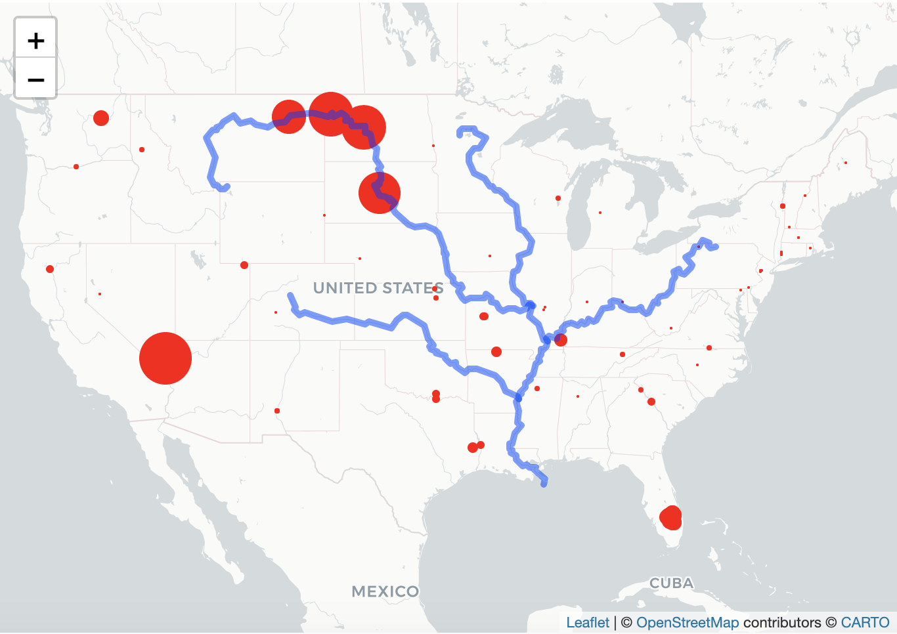
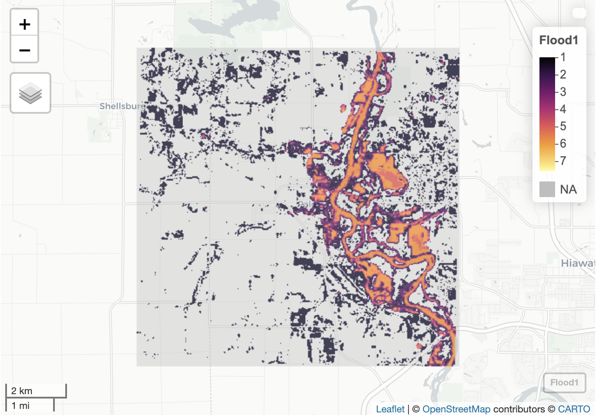

Welcome! This is my personal collaboration of GIS work based on the R script. 

---

In the **GIS Work 01**, I started to analyze the geographic points in the polygon, with the functions defined by myself. With the raw data of dams in the United States, I tried to find the relationship between the dam distribution and geographic information. 

# [Tesselations, Point-in-Polygon](https://needcola.github.io/geog-13-labs/lab-04.html)

- Focus: understanding how the tessellation works. Each tessellation has its own advantages and disadvantages, and different attributes. 
- Achievements: 
- Analysis of the dams' data in the United States with different tessellation and identifying the difference among them, and define the numbers of dam in each tiles; 
- With the distribution of different types, demonstrating the possible reasons of the distribution
- Generation of interactive leaflet map, which shows categorical data of dams in each state within Mississippi River System.

Here is my highlight in the project:

---

In the **GIS Work 02**, I use raster layers to analyze the continuous data, a case of flooding in Palo, Iowa. We used the raster pacakge and raster data knowledge to create flood images using multiband Landsat Imagery, thresholding and classification methods.

# [Raster and Remote Sensing](https://needcola.github.io/geog-13-labs/lab-05.html)

- Focus: manipulation of continuous data with raster data model, and mapping algebra to analyze elevation, precipitation, and climate.
- Achievements: 
- In the case of Palo, usage of kmean-rasters compared with Landsat band calculating the flooding cells shared by each layers
- Extraction of a specific location captured by the drone from layers to define its value in the raster data and presenting it on the interactive map

Here is my highlight in the project:

---

In the **GIS Work 03**, terrain analysis is managed by R coding. Mission Creek's flood event in 2017 in Santa Barbara, California has been chosen as object, estimating the number of buildings impacted. In the project, I completed the whole analysis from collecting data to the assessment of impacts.

# [Flood Risk in Mission Creek: Past, Present, Future](https://needcola.github.io/geog-13-labs/lab-06.html)

- Focus: use OSM data to collect building centroids and the stream linestring, and process spatial analysis of flooding in the study area.
- Achievements: 
- with the whitebox, create hillshade raster of Santa Barbara area and HAND raster for flooding cell values.
- The correcting of elevation is important in the data, which will impact the precision of analysis.
- In the final step, overlay all raster layers into one, indicating the impacted buildings when the creek flooded.
- create a gif for Mission Creek's flood inundation map library from 0 to 20 foot.

Here is my highlight in the project:

